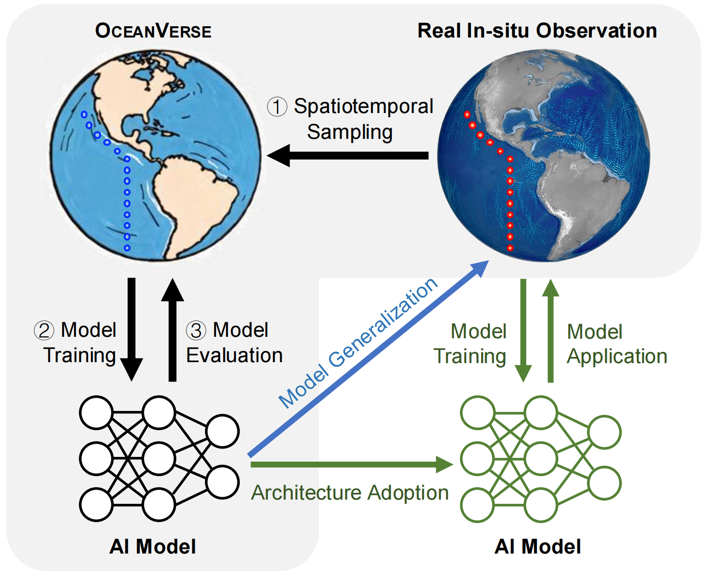

# OceanVerse

This repository contains the code implementation for the paper *OceanVerse: A Digital Twin Global Ocean Dataset for 4D Sparse Observation Reconstruction*.




## Project Structure
```
├── data/               # Directory for storing datasets
├── infer_result/       # Directory for experiment results
├── model_pkl/          # Directory for result models
├── README.md           # Project documentation
├── models.py           # Model implementation
├── utils.py            # Utility functions
└── main.py             # Training script
```

## Experiment Environment

- python 3.9

- pytorch 2.1+

- torch-geometric 2.4+


## Data Preparation

The dataset used in this project can be downloaded from https://huggingface.co/datasets/jingwei-sjtu/OceanVerse. After downloading, place the dataset folder under the data/ directory using the dataset name as the folder name. The expected directory structure is:

```
data/
└── CESM2-omip1/               # Example dataset name
    ├── split/                 # Train/validation splits in different split methods
    ├── graph/                 # Preprocessed graph structure per time step
    └── ground_truth/          # Ground-truth oxygen values for evaluating
```

## Basic Usage


### 1. Training with Custom Settings

You can specify different datasets, split strategies, and models for flexible experimentation. For example, training the MLP model with a specific configuration:

```
python main.py --batch_size 512 --num_layers 2 --input_dim 8 --hidden_dim 256 --model MLP --lr 1e-2 --split temporal  --dataset CESM2-omip1
```

- `--dataset`: Name of the dataset folder under `data/`

- `--split`: Data splitting strategy. Options:
  - `random`: Random split
  - `temporal`: Time-based split
  - `spatial`: Location-based split

- `--model`: Model architecture. Options include `MLP`, `LSTM`, `Oxygenerator`, etc.

Other common parameters include:

- `--batch_size`: Mini-batch size for training
- `--input_dim`: Input feature dimension
- `--hidden_dim`: Hidden layer size
- `--num_layers`: Number of layers
- `--lr`: Learning rate

### 2. Reproducing Benchmark Results
To reproduce the benchmark results reported in our paper, run the following commands for each model on five seeds, three different datasets and three split methods:

#### MLP

```
python main.py --batch_size 512 --num_layers 2 --input_dim 8 --hidden_dim 256 --model MLP --lr 1e-2 --split random 
```

#### LSTM

```
python main.py --batch_size 512 --num_layers 2 --input_dim 8 --hidden_dim 256 --model MLP --lr 1e-2 
```

#### Transformer

```
python main.py --batch_size 512 --num_layers 1 --input_dim 8 --hidden_dim 32 --model Transformer --lr 1e-2 
```

#### Oxygenerator

```
python main.py --batch_size 512 --num_layers 2 --input_dim 8 --hidden_dim 256 --model MLP --lr 1e-4 
```

#### XGBoost

```
python main_XGBoost.py --batch_size 512 --num_layers 2 --input_dim 8 --hidden_dim 256 --model MLP --lr 1e-2
```


### Evaluate

To evaluate model performance, run the script in `evaluate.ipynb`. Make sure to modify the following items in the notebook before execution:

- Set the correct dataset name
- Provide the path to the saved model predictions in the `infer_result` folder


## Contact

Bin Lu (robinlu1209@sjtu.edu.cn), Jingjing Shen (dorisshen@sjtu.edu.cn), Ze Zhao (zhaoze@sjtu.edu.cn)