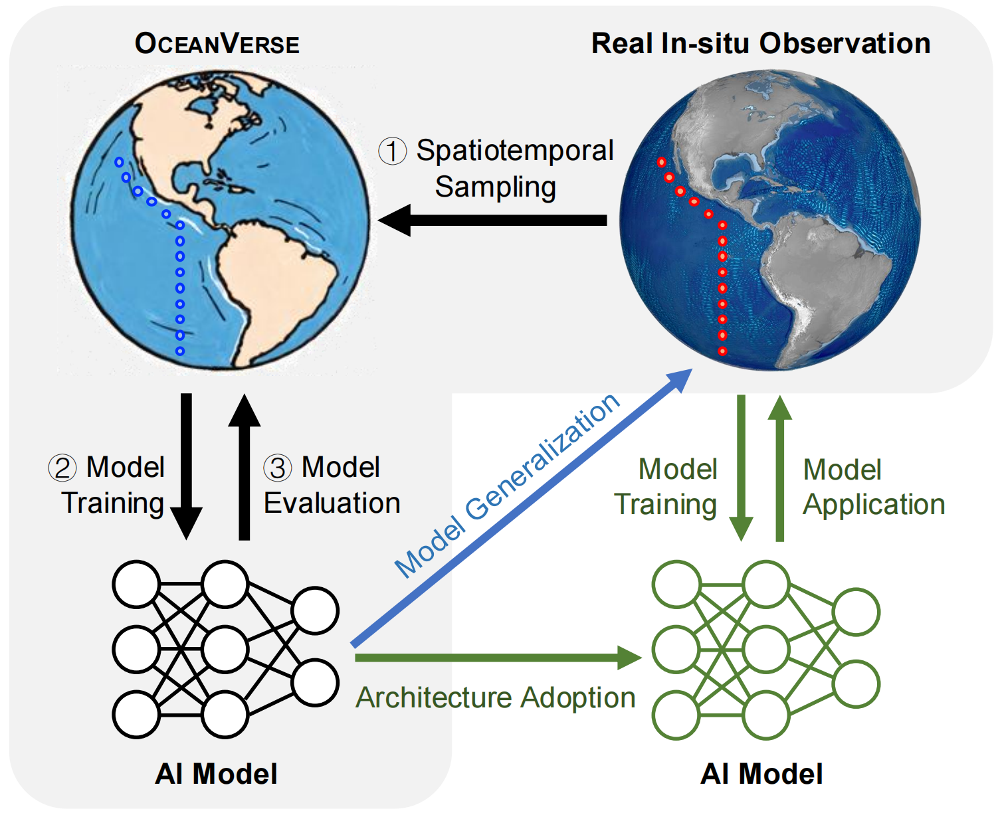

# OceanVerse

This repository contains the code implementation for the paper *OceanVerse: Towards Evaluable 4D Ocean Element Reconstruction Dataset under Realistic Sparsity*. OceanVerse is a comprehensive dataset designed to address the challenge of reconstructing sparse ocean observation data. It integrates nearly 2 million real-world profile data points since 1900 and three sets of Earth system numerical simulation data. OceanVerse provides a novel large-scale (∼100× nodes vs. existing datasets) dataset that meets the MNAR (Missing Not at Random) condition, supporting more effective model comparison, generalization evaluation and potential advancement of scientific reconstruction architectures. The dataset and codebase are publicly available to promote further research and development in the field of AI4Ocean.

<p align="center">
  
</p>


## Project Structure
```
├── data/               # Directory for storing datasets
├── infer_result/       # Directory for experiment results
├── model_pkl/          # Directory for result models
├── README.md           # Project documentation
├── models.py           # Model implementation
├── utils.py            # Utility functions
└── main.py             # Training script
```

## Experiment Environment

We provide two ways to set up the environment: a standard `pip`/`conda` workflow and a `uv` workflow.
**Note:** Please make sure that the CUDA version in your environment matches the installed PyTorch and PyG extension packages. The commands below are written for the **CUDA 12.1 (`cu121`)** setup used in our current environment.  
If you are using a different CUDA version, please replace the corresponding wheel source accordingly.

### Option 1: Conda + pip

```bash
conda create -n OceanVerse python=3.10
conda activate OceanVerse

pip install -r requirements.txt
pip install torch-scatter torch-sparse -f https://data.pyg.org/whl/torch-2.1.0+cu121.html
```

### Option 2: uv

```bash
uv sync
source .venv/bin/activate
uv pip install -p .venv/bin/python torch-scatter torch-sparse -f https://data.pyg.org/whl/torch-2.1.0+cu121.html
```

## Data Preparation

### Dataset Structure

The dataset used in this project can be downloaded from https://huggingface.co/datasets/jingwei-sjtu/OceanVerse. After downloading, place the dataset folder under the data/ directory using the dataset name as the folder name. The expected directory structure will be as follows:

```
YOUR_LOCAL_DIR/
├── CESM2_omip1/
│   ├── omip1_indices/          # split indices of CESM2-OMIP1 (random split, temporal split and spatial split)
│   ├── omip1_graph/            # Graph-structured data (model input)
│   └── omip1_ground_truth/     # Ground truth of CESM2-OMIP1
├── CESM2_omip2/
│   ├── omip2_indices/          # split indices of CESM2-OMIP2 (random split, temporal split and spatial split)
│   ├── omip2_graph/            # Graph-structured data (model input)
│   └── omip2_ground_truth/     # Ground truth of CESM2-OMIP2
├── GFDL_ESM4/
│   ├── GFDL_indices/           # split indices of GFDL-ESM4 (random split, temporal split and spatial split)
│   ├── GFDL_graph/             # Graph-structured data (model input)
│   └── GFDL_ground_truth/      # Ground truth of GFDL-ESM4
├── .gitattributes
└── README.md
```
### Subfolder Description

#### Indices (`*_indices/`)

Each indices folder contains **7 split index files** (all in `.pt` format) used to partition the data:

| File | Description |
|------|-------------|
| `random_split_seed1.pt` | Random splits of observation data into training/validation sets (7:3 ratio) with seed 1 |
| `random_split_seed2.pt` | Random splits of observation data into training/validation sets (7:3 ratio) with seed 2 |
| `random_split_seed3.pt` | Random splits of observation data into training/validation sets (7:3 ratio) with seed 3 |
| `random_split_seed4.pt` | Random splits of observation data into training/validation sets (7:3 ratio) with seed 4 |
| `random_split_seed5.pt` | Random splits of observation data into training/validation sets (7:3 ratio) with seed 5 |
| `temporal_split.pt` | Time-based split: first 70% of years for training, remaining 30% for validation |
| `spatial_split.pt` | Geography-based split across 5 ocean regions (Atlantic, Pacific, Indian, Polar, Enclosed Seas) in a 7:3 ratio |

All index files are stored as **PyTorch tensors (`.pt`)**. They identify which spatiotemporal locations have observations and are used to construct MNAR (Missing Not at Random) masks.

#### Graph (`*_graph/`)

| Content | File Format | Purpose |
|---------|-------------|---------|
| Graph-structured data (one file per year) | `.pt` (PyTorch tensor) | Graph input for the model, containing spatiotemporal adjacency information |

#### Ground Truth (`*_ground_truth/`)

| Model | Filename | File Format | Description |
|-------|----------|-------------|-------------|
| CESM2-OMIP1 | `OMIP1_do.npy` | NumPy array (`.npy`) | Dissolved oxygen ground truth |
| CESM2-OMIP2 | `OMIP2_do.npy` | NumPy array (`.npy`) | Dissolved oxygen ground truth |
| GFDL-ESM4 | `GFDL_do.npy` | NumPy array (`.npy`) | Dissolved oxygen ground truth |

### One-Step Download

```bash
# Step 1: Install uv (skip if already installed)
pip install uv

# Step 2: Download the dataset
uvx hf download jingwei-sjtu/OceanVerse --repo-type=dataset --local-dir 'YOUR_LOCAL_DIR'

# If a proxy is required:
HTTP_PROXY='YOUR_HTTP_PROXY' HTTPS_PROXY='YOUR_HTTPS_PROXY' \
  uvx hf download jingwei-sjtu/OceanVerse --repo-type=dataset --local-dir 'YOUR_LOCAL_DIR'
```

## Basic Usage


### 1. Training with Custom Settings

You can specify different datasets, split strategies, and models for flexible experimentation. For example, training the MLP model with a specific configuration:

```
python main.py --batch_size 512 --num_layers 2 --input_dim 8 --hidden_dim 256 --model MLP --lr 1e-2 --split temporal  --dataset CESM2-omip1
```

- `--dataset`: Name of the dataset folder under `data/`

- `--split`: Data splitting strategy. Options:
  - `random`: Random split
  - `temporal`: Time-based split
  - `spatial`: Location-based split

- `--model`: Model architecture. Options include `MLP`, `LSTM`, `Oxygenerator`, etc.

Other common parameters include:

- `--batch_size`: Mini-batch size for training
- `--input_dim`: Input feature dimension
- `--hidden_dim`: Hidden layer size
- `--num_layers`: Number of layers
- `--lr`: Learning rate

### 2. Reproducing Benchmark Results
To reproduce the benchmark results reported in our paper, run the following commands for each model on five seeds, three different datasets and three split methods:

#### MLP

```
python main.py --batch_size 512 --num_layers 2 --input_dim 8 --hidden_dim 256 --model MLP --lr 1e-2 --split random 
```

#### LSTM

```
python main.py --batch_size 512 --num_layers 2 --input_dim 8 --hidden_dim 256 --model MLP --lr 1e-2 
```

#### Transformer

```
python main.py --batch_size 512 --num_layers 1 --input_dim 8 --hidden_dim 32 --model Transformer --lr 1e-2 
```

#### Oxygenerator

```
python main.py --batch_size 512 --num_layers 2 --input_dim 8 --hidden_dim 256 --model Oxygenerator --lr 1e-4 
```

#### XGBoost

```
python main_XGBoost.py
```


### Evaluate

To evaluate model performance, run the script in `evaluate.ipynb`. Make sure to modify the following items in the notebook before execution:

- Set the correct dataset name
- Provide the path to the saved model predictions in the `infer_result` folder
